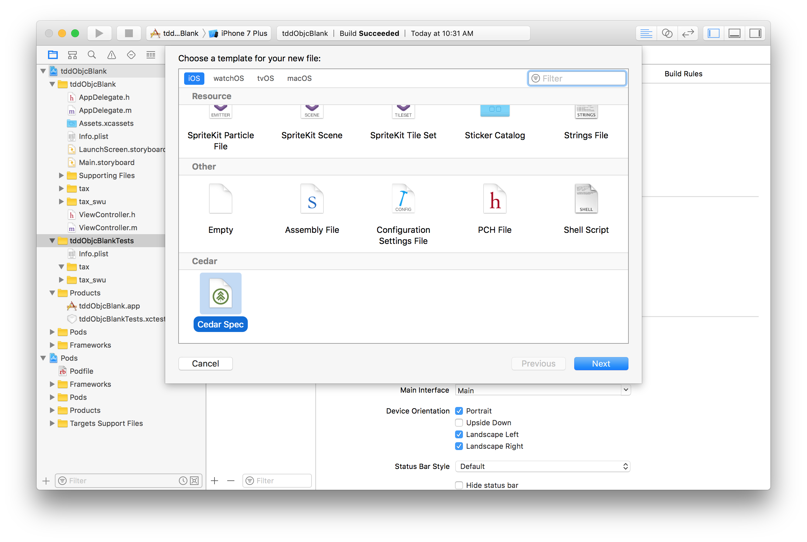
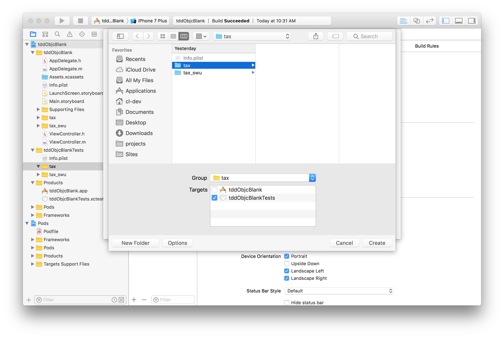
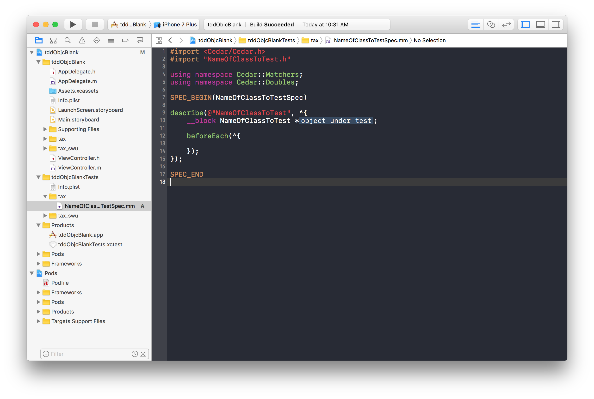

# tdd-objc-barebone

[](https://travis-ci.org/sksw/tdd-objc-barebone)
[](https://dashboard.buddybuild.com/apps/58efe5b662a5f90001e13dc3/build/latest?branch=ci)
[](https://circleci.com/gh/sksw/tdd-objc-barebone/tree/ci)

The aim of this tutorial is to **(1)** provide a barebone Objective-C TDD environment for developers to play around with, and **(2)** introduce developers to [BDD](https://en.wikipedia.org/wiki/Behavior-driven_development) style testing on iOS.

If you're brand new to TDD or doing it from a BDD perspective, then you're in the right place.  Follow the setup instructions below and work through the provided BDD exercise to learn the basics!

- [Setting Up](#setting-up)
- [The BDD Exercise](#the-bdd-exercise)
- [Helpful Tips](#helpful-tips)
    - [Boiler plate & auto-completion](#boiler-plate-and-auto-completion)
    - [The anatomy of a spec](#the-anatomy-of-a-spec)
    - [Creating a new spec](#creating-a-new-spec)
- [A Few Notes on Tooling](#a-few-notes-on-tooling)

## Setting Up

1. `pod install`, if you don't have cocoapods, try `$ sudo gem install cocoapods` or visit the [CocoaPods getting started site](https://guides.cocoapods.org/using/getting-started.html)
2. `tddObjcBlank.xcworkspace`
3. Hit `⌘`+`U` to run the tests.  You should see something like,
```
Finished in 0.0062 seconds

0 examples, 0 failures
Test Suite 'All tests' passed at 2017-04-11 17:18:49.269.
	 Executed 0 tests, with 0 failures (0 unexpected) in 0.000 (0.036) seconds
```

and voila!  You're good to go!


## The BDD Exercise

> Build a calculator that computes the total cost of a list of goods.  Tax rules are as follows,
>   * _10% HST on all goods except books and food_
>   * _5% GST on books_
>   * _Food is tax exempt_

In this exercise, we've decided to split the feature into the stories **A**, **B**, **C**, and **D** below.

Begin by opening `tddObjcBlankTests/tax/ItemSpec.mm` and writing a failing test for the first story.  Then continue to `tddObjcBlank/tax/Item.m` to fill out the passing implementation.  Don't forget to check out [these tips](#helpful-tips).  Go [here](#a-few-notes-on-tooling) if you're interested in learning a bit more about the TDD framework.

**Story A**

> **Given:**  Jimmy is in a hurry to purchase some goods.  
> **When:**  Jimmy supplies his list of items to the cost calculator.  
> **Then:**  Jimmy is shown the final cost of his goods with 10% HST added.  

**Story B**

> **Given:**  Jimmy is looking to purchase some books (HST exempt, but subject to 5% GST tax).  
> **When:**  Jimmy supplies his list of books to the cost calculator.  
> **Then:**  Jimmy is shown the final cost of his books with 5% GST added.  

**Story C**

> **Given:**  Jimmy is feeling hungry, but first needs to know the wallet-damage of his food (tax exempt).  
> **When:**  Jimmy supplies his list of produce to the cost calculator.  
> **Then:**  Jimmy is shown the final cost of his food with no tax added.  

**Story D**

> **Given:**  Jimmy is mindful of his budget and wishes to know the total cost of his shopping list before buying.  
> **When:**  Jimmy supplies his shopping list to the cost calculator.  
> **Then:**  Jimmy is shown an accurate final cost of his shopping list with tax included.  
>  
> **Acceptance Criteria:**  
> - 10% HST on all goods except books and food  
> - 5% GST on books  
> - food is tax exempt  

A set of solutions to this exercise can be found under the `tax_swu` folder.  To run the tests, simply remove the `x` from `xdescribe` in each spec.

## Helpful Tips

- `⌘`+`U` to run tests.
- prefix `f` to focus the test (on a `describe`, `context`, or `it`)
- prefix `x` to exclude the test (on a `describe`, `context`, or `it`)
- use `cdes`, `cccont`, and `cit` to quickly write tests (if you don't have these snippets, install them [here](#boiler-plate-and-auto-completion))

### Boiler plate and auto-completion

You may want to run,

```
$ git clone https://github.com/pivotal/cedar.git && cd cedar
$ ./installCodeSnippetsAndTemplates # or rake install
```
and restart Xcode to get the `Cedar` template and snippets.  The template makes creating pre-formatted `spec` files easy, and the snippets make writing new tests easy.

### Creating a new spec

Hit `⌘`+`N` and choose to create a new cedar spec,



The name of the spec will be the name of the class you'd like to test.  Make sure you're adding the file to the test target.



And you're good to go.  Read the next section about the [anatomy of a spec](#anatomy-of-a-spec) if you're unsure about what to do next.



### The anatomy of a spec

Your tests should read like an English sentence that _describes_ input, stimulus, and output.  For example, a story like,

> **Given:**  Human beings experience pain negatively.  
> **When:**  A person is kicked.  
> **Then:**  He/she cries out in pain.  

Your test might look like,

```objective-c
describe(@"Person", ^{
    __block MyPerson *subject;
    
    describe(@"kicked", ^{
        beforeEach(^{
            // This is where you setup your pre-conditions (i.e. the 'GIVEN' items)
            subject = [[MyPerson alloc] init];
            // After setting up your pre-conditions, you'll also want to 'kick-off' your test (i.e. the 'WHEN' items).
            [subject kick];
        });
        it(@"should cry out in pain", ^{
            // This is where you assert your outcome (i.e. the 'THEN')
            subject.isCryingOutInPain should be_truthy;
        });
    });
});
```

And when you run your test, you'll see the following in the console,

```
Test Case '-[MyPerson kicked_should_cry_out_in_pain]' started.
Test Case '-[MyPerson kicked_should_cry_out_in_pain]' passed (0.001 seconds).
```

Functionally, `describe` and `context` work exactly the same, but `context` is typically used to contrast parallel paths in the code.  For example,

```objective-c
describe(@"Person", ^{
    __block MyPerson *subject;
    
    describe(@"kicked", ^{
        beforeEach(^{
            subject = [[MyPerson alloc] init];
        });
        context(@"hard", ^{
            beforeEach(^{
                [subject kickHard];
            });
            it(@"should cry out in pain", ^{
            });
        });
        context(@"softly", ^{
            beforeEach(^{
                [subject kickSoftly];
            });
            it(@"should giggle", ^{
            });
        });
    });
});
```

As you probably noticed, you can include a `beforeEach` at each level of testing.  Setup and teardown happens for every single test so (1) no test contamination occurs, and (2) you can count on every `beforeEach` to happen in sequence leading up to your `it`.

You may have also noticed that the nesting makes things look quite confusing.  My suggestion is to avoid more than 2 or 3 levels of nesting, and move the `subjectAction` into the asset where appropriate.  Remember, the focus is on _**readability, maintainability, and living documentation**_, **not** on _**dogmatic structuring**_.

## A Few Notes on Tooling

In this example, the test framework we are using is [Cedar](https://github.com/pivotal/cedar).  It builds on top of `XCTest` to provide a BDD-styled way of writing tests in iOS.  It comes with a helpful set of matchers (for asserting and comparing outcomes) built in, and provides the ability to create custom matchers.

Another very popular test framework is [Kiwi](https://github.com/kiwi-bdd/Kiwi).  It compliments nicely with additional matches from [Expecta](https://github.com/specta/expecta).

This tutorial only covers testing in Objective-C, for Swift, visit [tdd-swift-barebone](https://github.com/connected-swu/tdd-swift-barebone).

